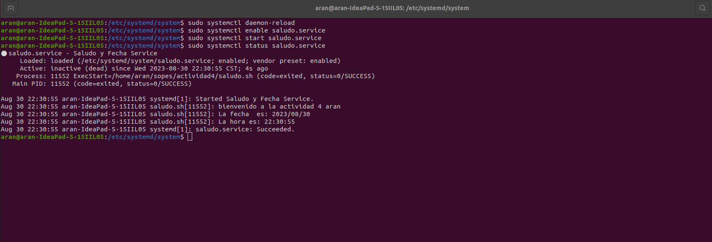

# Actividad 4

# Jose Ignacio Martinez Hernandez <br> 201408507


## Paso 1: Script

### Crear el script

```bash
#!/bin/bash

echo "bienvenido a la actividad 4 aran"
echo "La fecha  es: $(date +%Y/%m/%d)"
echo "La hora es: $(date +%H:%M:%S)"
```

### Darle permisos de ejecución

```bash
sudo chmod +x saludo.sh
```
## Paso 2: Service

### Crear el Service en la carpeta /etc/systemd/system

```bash

[Unit]
Description=Saludo y Fecha Service
After=network.target

[Service]
Type=simple
ExecStart="/home/aran/sopes/actividad4/saludo.sh"

[Install]
WantedBy=default.target

```

## Paso 3: Instalar y Habilitar el Servicio

### Abrir una terminal con privilegios de administrador y ejecutar los siguiente comandos


### Recargar los servicios systemd
```bash
sudo systemctl daemon-reload
```

### Habilitar el servicio para que se inicie en el arranque
```bash
sudo systemctl enable saludo_fecha.service
```

### Iniciar el servicio
```bash
sudo systemctl start saludo_fecha.service
```

### Verificar el estado del servicio
```bash
sudo systemctl status saludo_fecha.service

```
### Comprobando  el servicio
<p align="center">
  
</p>

